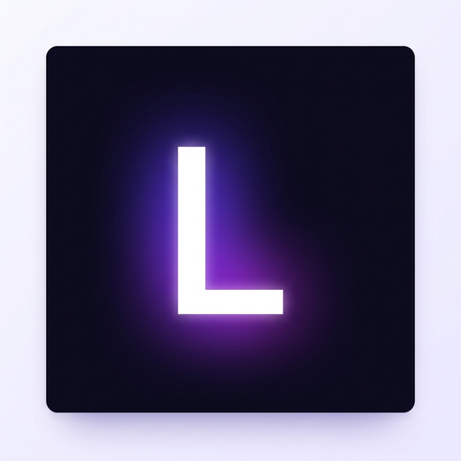

<div align="center">



# LifeOS

### AI Chief of Staff for Students

**A phone-first, multi-agent AI system that converts student chaos — screenshots, PDFs, emails, notices — into structured action: tasks, schedules, study plans, and placement prep workflows.**

[](https://nextjs.org)
[](https://tailwindcss.com)
[](https://ai.google.dev)
[](https://groq.com)
[](https://supabase.com)
[](https://clerk.com)
[](https://vercel.com)
[](https://github.com/TuShArBhArDwA/LifeOS/blob/main/LICENSE)

</div>

---

## What is LifeOS?

Students receive critical information — placement notices, assignment deadlines, exam schedules — scattered across WhatsApp groups, emails, PDFs, and notice boards. No tool understands this chaos automatically.

**LifeOS does.** Drop a screenshot or PDF. In under 10 seconds, LifeOS:

- Reads and understands the document using **Gemini 2.0 Flash** (vision)
- Checks your **eligibility automatically** against your student profile
- Creates **prioritized tasks** with due dates
- Generates **calendar events** and study blocks
- Builds a **placement prep plan** for company drives
- Sets **context-aware reminders** that explain why they matter

Zero typing. Zero app-switching. One upload.

---

## Demo

> **Live demo scenario:** Student uploads a TCS NQT placement notice screenshot from WhatsApp.

| Step | What happens |
|---|---|
| Upload | Student photographs the notice on their iQOO phone |
| Orchestrator | Gemini reads the image, extracts company, deadline, and eligibility criteria |
| Agents activate | Task, Schedule, Placement, and Reminder agents run in parallel |
| Output | Eligibility checked, 5 tasks created, 6 calendar events, 3-week prep plan, 3 reminders |
| Total time | Under 10 seconds |

---

## Features

### Multi-modal Input
- Drag and drop screenshot or PDF
- Camera capture (phone-native)
- Text paste for forwarded messages

### 5 AI Agents

| Agent | Responsibility | Model |
|---|---|---|
| Orchestrator | Reads input, classifies intent, routes to agents | Gemini 2.0 Flash (vision) |
| Task Agent | Generates prioritized tasks with deadlines | Gemini 2.0 Flash |
| Schedule Agent | Creates calendar events and study blocks | Gemini 2.0 Flash |
| Placement Agent | Eligibility check, document checklist, prep plan | Gemini 2.0 Flash |
| Reminder Agent | Context-aware nudges with timing | Groq llama-3.1-8b |

### Intent Detection

Automatically classifies input as:
- `placement_notice` — Full placement workflow
- `assignment` — Task, schedule, and reminder
- `exam` — Study plan and time blocks
- `fee_notice` — Deadline task and reminder
- `general` — Best-fit action generation

### Phone-First PWA
- Installable on homescreen
- Touch-optimized UI with 44px+ tap targets
- Camera API integration for direct capture
- Works seamlessly with **iQOO Office Kit** for screen mirroring

---

## Tech Stack

```
Frontend    ->  Next.js 16 (App Router) + Tailwind CSS v3
Auth        ->  Clerk
Database    ->  Supabase (Postgres + Storage)
Primary AI  ->  Google Gemini 2.0 Flash (vision + structured JSON)
Fast AI     ->  Groq llama-3.1-8b-instant (text generation)
Deployment  ->  Vercel
```

---

## Project Structure

```
lifeos/
├── app/                      # Next.js App Router
│   ├── page.tsx              # Landing page
│   ├── onboarding/           # First-time profile setup
│   ├── dashboard/            # Main student dashboard
│   ├── upload/               # Core upload + agent interaction
│   └── api/
│       ├── intake/           # POST — orchestrates all agents
│       └── profile/          # GET/POST — student profile
├── components/
│   ├── UploadZone.tsx        # File drop / camera / text input
│   ├── AgentThinking.tsx     # Animated agent processing UI
│   └── ActionCards.tsx       # Output cards (tasks, events, placement, reminders)
├── lib/
│   ├── gemini.ts             # Gemini client + multimodal helpers
│   ├── groq.ts               # Groq client
│   ├── supabase.ts           # Supabase client + TypeScript types
│   └── agents/
│       ├── orchestrator.ts   # Intent classification + routing
│       ├── task-agent.ts     # Task generation
│       ├── schedule-agent.ts # Calendar event generation
│       ├── placement-agent.ts# Eligibility check + prep plan
│       └── reminder-agent.ts # Reminder generation (via Groq)
├── docs/
│   ├── HLD.md                # High Level Design
│   ├── LLD.md                # Low Level Design
│   └── LifeOS-pitch-deck.pdf # Hackathon pitch deck
├── public/
│   ├── manifest.json         # PWA manifest
│   ├── icon-192.png          # App icon
│   └── icon-512.png          # Splash icon
├── scripts/
│   ├── supabase-schema.sql   # Paste into Supabase SQL Editor
│   └── seed-demo-data.sql    # Optional: demo data for testing
├── proxy.ts                  # Clerk auth proxy
└── .env.local                # API keys (gitignored — see setup)
```

---

## Getting Started

### Prerequisites
- Node.js 18+
- Accounts on: [Clerk](https://clerk.com), [Supabase](https://supabase.com), [Google AI Studio](https://aistudio.google.com), [Groq](https://console.groq.com)

### 1. Clone the repo

```bash
git clone https://github.com/TuShArBhArDwA/LifeOS.git
cd LifeOS
```

### 2. Install dependencies

```bash
npm install
```

### 3. Set up environment variables

Create a `.env.local` file in the root:

```env
# Clerk
NEXT_PUBLIC_CLERK_PUBLISHABLE_KEY=pk_test_...
CLERK_SECRET_KEY=sk_test_...
NEXT_PUBLIC_CLERK_SIGN_IN_URL=/sign-in
NEXT_PUBLIC_CLERK_SIGN_UP_URL=/sign-up
NEXT_PUBLIC_CLERK_AFTER_SIGN_IN_URL=/dashboard
NEXT_PUBLIC_CLERK_AFTER_SIGN_UP_URL=/onboarding

# Supabase
NEXT_PUBLIC_SUPABASE_URL=https://your-project.supabase.co
NEXT_PUBLIC_SUPABASE_ANON_KEY=your_anon_key
SUPABASE_SERVICE_ROLE_KEY=your_service_role_key

# AI
GEMINI_API_KEY=your_gemini_key
GROQ_API_KEY=your_groq_key
```

### 4. Set up Supabase database

Go to your Supabase project → **SQL Editor** → paste and run [`scripts/supabase-schema.sql`](scripts/supabase-schema.sql).

> **Optional:** Run [`scripts/seed-demo-data.sql`](scripts/seed-demo-data.sql) after the schema to populate a demo student profile and sample data for testing the dashboard.

### 5. Run locally

```bash
npm run dev
```

Open [http://localhost:3000](http://localhost:3000) on your phone browser for the best experience.

---

## Architecture

See [`docs/HLD.md`](docs/HLD.md) for the full system architecture with diagrams.  
See [`docs/LLD.md`](docs/LLD.md) for database schema, API contracts, and agent design.

### Quick overview

```
Student Upload (phone)
       |
/api/intake -> Orchestrator (Gemini Vision)
       |
{ intent, extracted_data, agents_to_invoke[] }
       | (parallel)
Task Agent + Schedule Agent + Placement Agent + Reminder Agent
       |
Save to Supabase -> Return to client -> Render Action Cards
```

---

## Deployment

```bash
npx vercel --prod
```

Or connect the GitHub repo to [vercel.com](https://vercel.com) and add environment variables in the dashboard.

---

## License

MIT © [Tushar Bhardwaj](https://github.com/TuShArBhArDwA)
