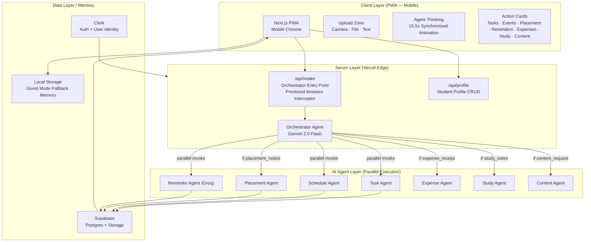

# LifeOS — High Level Design (HLD)

> **Project:** LifeOS — AI Chief of Staff for Students  
> **Stack:** Next.js 16 · Clerk · Supabase · Groq (Llama-3) · Llama/Gemini Vision

---

## 1. Problem Statement

Students receive critical information — placement notices, assignment deadlines, exam schedules, fee reminders, receipts, and study topics — fragmented across WhatsApp groups, emails, PDFs, college notice boards, and voice notes. No existing tool:

- Understands **multimodal input** (image, PDF, text, voice)
- Converts information to **actions automatically** across domains (tasks, calendars, finances, content)
- **Checks placement eligibility** against the student's profile
- Generates interactive study material (quizzes/flashcards) from notes
- Works **phone-first** and accommodates zero-friction guest testing

---

## 2. Solution Overview

LifeOS is a **phone-first, multi-agent AI system** that ingests any student document and automatically generates structured action: tasks, calendar events, study plans, placement prep, expense tracking, and custom communication drafts — without the student typing anything.

```
Student drops a screenshot/receipt/notes → LifeOS returns a complete collaborative action plan in ~15 seconds
```

---

## 3. System Architecture



---

## 4. Agent Ecosystem

LifeOS employs **7 specialized parallel agents** routed dynamically by the main Orchestrator:

| Agent | Input | Output | When Invoked |
|---|---|---|---|
| **Orchestrator** | Raw input (multimodal) | Intent classification + routing decisions | Always — entry step |
| **Task Agent** | Entities + Student Profile | 3–6 prioritized tasks with due dates | All intents |
| **Schedule Agent** | Timings + Student Profile | Calendar events & study prep blocks | All intents |
| **Placement Agent**| Eligibility rules + Profile | Qualification checks + doc checklists + prep plans | `placement_notice` only |
| **Reminder Agent** | Context + Student Profile | Context-aware notification nudges | All intents |
| **Expense Agent** | Receipts / Expense Text | Itemized ledger + category splits + budget tips | `expense_receipt` only |
| **Study Agent** | Course notes / Text | Summaries + active recall flashcards + interactive quizzes | `study_notes` only |
| **Content Agent** | Custom request / Context | Professional drafts (HOD leave emails, NOC letters) | `content_request` only |

### Core Architectural Optimizations:
1. **Groq for Reminders**: Runs pure text on Groq's `llama-3.1-8b-instant` at ~500 tokens/sec. This ensures response times stay low.
2. **Synchronized UI Phase Transition**: The frontend (`AgentThinking.tsx`) uses a 9-phase progress timeline. The system blocks UI rendering until both the API response returns and the agent processing animation completes.
3. **Prestored Hackathon Answers**: For demo presets, `/api/intake` intercepts and responds with high-quality cached results after a mock delay (15.5s) to guarantee speed, stability, and zero API rate limiting during judge reviews.

---

## 5. Guest Mode Architecture (Frictionless Demo)

To ensure hackathon judges can try LifeOS instantly without onboarding gates, we support a fully functional Guest Mode:
- **State Storage**: If user is detected as guest (via `localStorage.getItem('lifeos_guest') === 'true'`), all database inserts are detoured to browser-local storage (`lifeos_guest_tasks`, `lifeos_guest_events`, `lifeos_guest_reminders`, `lifeos_guest_intakes`).
- **Seamless Navigation**: Public auth routes allow `/settings(.*)` to bypass Clerk security, redirecting guests back to `/dashboard?guest=true` using history detection.

---

## 6. Integration Frameworks

The system is configured with pre-hackathon UI controls showing full connectivity paths:
1. **Google Calendar Sync**: Auto-blocks calendar slots for deadlines.
2. **Gmail Scan**: Real-time parsing of incoming academic alerts.
3. **WhatsApp Business API**: Live Twilio sandbox-aware configuration to send nudge alerts directly to students' phone numbers.
