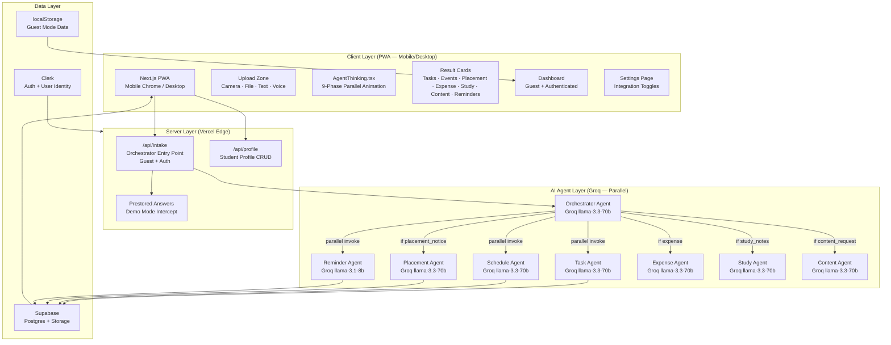
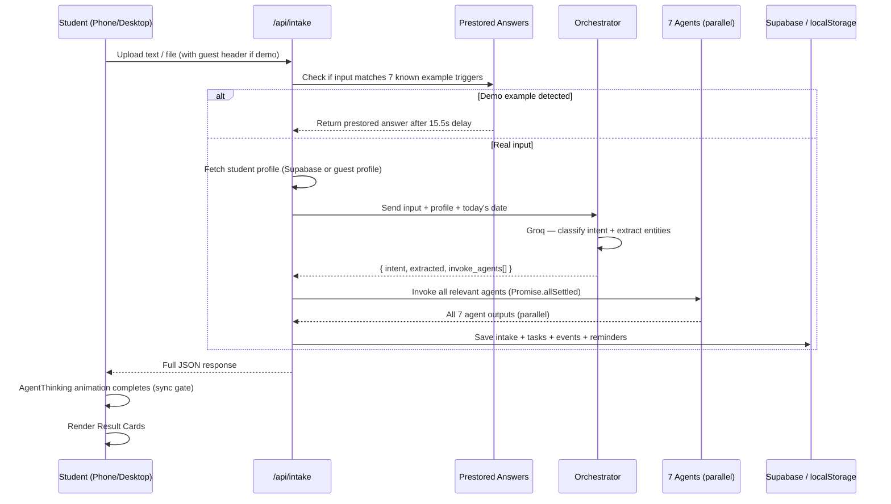
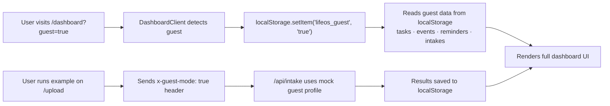
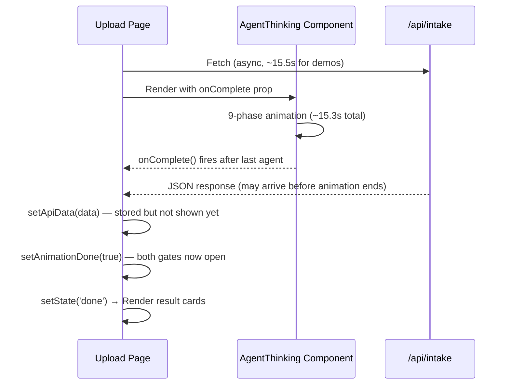
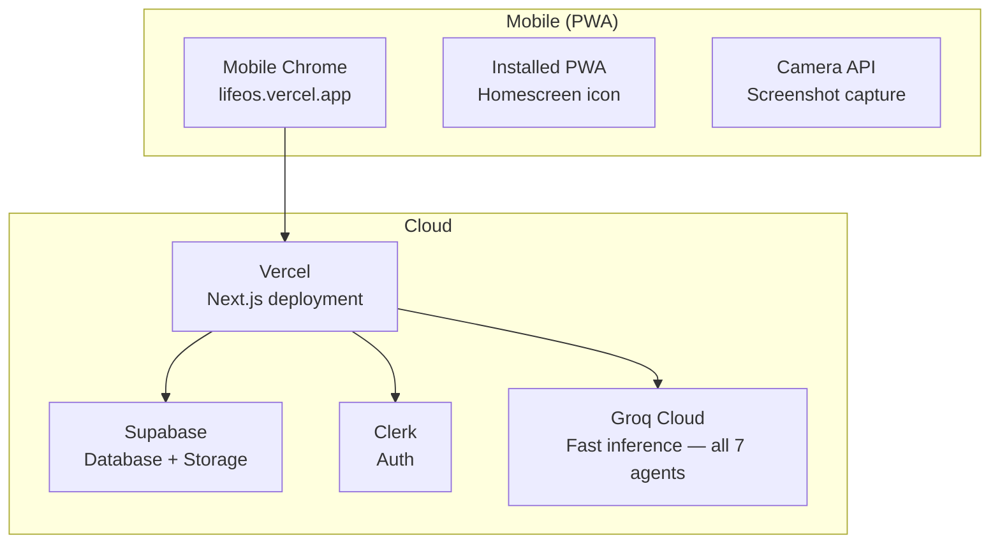

# LifeOS — High Level Design (HLD)

> **Project:** LifeOS — AI-Powered Collaborative Student Command Center  
> **Stack:** Next.js · Clerk · Supabase · Groq (llama-3.3-70b-versatile + llama-3.1-8b-instant)  
> **Version:** 2.0 — Hackathon Build

---

## 1. Problem Statement

Students receive critical information — placement notices, assignment deadlines, exam schedules, fee reminders, expense receipts, and study notes — fragmented across WhatsApp groups, emails, PDFs, and voice memos. No existing tool:

- Understands **multimodal input** (image, PDF, text, voice)
- Converts information to **actions automatically** across multiple domains
- **Checks eligibility** against the student's profile
- Parses **expenses** and generates budget tips
- Builds **interactive study kits** (flashcards, quizzes) from raw notes
- Drafts **professional content** (emails, leave letters, NOC requests)
- Works **friction-free** — no login required for demo/guest experience

---

## 2. Solution Overview

LifeOS is a **phone-first, multi-agent AI system** that ingests any student document and automatically generates structured action across 7 specialized domains — tasks, calendar events, study plans, placement prep, expense tracking, draft content, and reminders — all running in parallel.

```
Student drops anything →  7 AI agents collaborate in parallel →  Complete action plan in ~15 seconds
```

**Key differentiators vs. v1:**
- Expanded from 4 agents to **7 parallel agents**
- Switched AI engine from Gemini to **Groq only** (faster, no vision fallback needed)
- Added **Guest Mode** — zero friction, no signup required, localStorage-backed
- Added **Settings page** with production-ready integration toggles
- Added **prestored demo answers** to avoid rate limits during live demos
- Implemented **animation–API synchronization** so results appear only after all agents visually complete

---

## 3. System Architecture



---

## 4. Agent Ecosystem

| Agent | Model | Input | Output | When Invoked |
|---|---|---|---|---|
| **Orchestrator** | Groq llama-3.3-70b-versatile | Raw text / image desc | Intent + extracted JSON + routing decision | Always — first step |
| **Task Agent** | Groq llama-3.3-70b-versatile | Orchestrator output + profile | 3–6 prioritized tasks with due dates | All intents |
| **Schedule Agent** | Groq llama-3.3-70b-versatile | Orchestrator output + profile | 3–8 calendar events (deadlines + study blocks) | All intents |
| **Placement Agent** | Groq llama-3.3-70b-versatile | Orchestrator output + profile | Eligibility check + doc checklist + prep plan | `placement_notice` only |
| **Reminder Agent** | Groq llama-3.1-8b-instant | Orchestrator output + profile | 3 context-aware reminder messages with timing | All intents |
| **Expense Agent** | Groq llama-3.3-70b-versatile | Raw text / receipt | Parsed items + categories + budget tip | `expense_receipt` intent |
| **Study Agent** | Groq llama-3.3-70b-versatile | Study notes text | Summary + flashcards + quiz questions | `study_notes` intent |
| **Content Agent** | Groq llama-3.3-70b-versatile | User request text | Professional draft (email, letter, NOC) | `content_request` intent |

### Why Groq exclusively?

All agents now run on Groq. The `llama-3.3-70b-versatile` model provides excellent structured JSON output with ~500ms latency per agent call. Running all 7 agents via `Promise.allSettled` keeps the full pipeline under 15 seconds even for the most complex multi-domain inputs.

---

## 5. Data Flow



---

## 6. Intent Classification

The Orchestrator classifies every input into one of 8 intents:

| Intent | Example Trigger | Agents Invoked |
|---|---|---|
| `placement_notice` | "TCS NQT Drive — Register by Friday" | Task + Schedule + Placement + Reminder |
| `assignment` | "DBMS project due this Friday" | Task + Schedule + Reminder |
| `exam` | Exam timetable PDF | Task + Schedule + Reminder |
| `timetable` | Weekly class schedule | Schedule + Reminder |
| `fee_notice` | "Fee payment deadline June 30" | Task + Reminder |
| `expense_receipt` | "Spent ₹80 at canteen, ₹45 auto" | Expense + Reminder |
| `study_notes` | Raw lecture notes / study material | Study + Task + Reminder |
| `content_request` | "Draft a leave letter to HOD" | Content + Reminder |
| `general` | Any other student notice | Task + Reminder |

---

## 7. Guest Mode Architecture

LifeOS supports a fully functional **Guest Mode** — no login, no Supabase, no Clerk required.



**Guest profile (hardcoded in API):**
```json
{
  "id": "guest_user",
  "name": "Guest Student",
  "cgpa": 9.2,
  "branch": "CSE",
  "year": 3,
  "college": "iQOO Institute of Tech"
}
```

Guest data is cleared on browser tab close (`beforeunload` event).

---

## 8. Animation–API Synchronization

A critical UX mechanism ensures results never appear before all agents finish animating:



**Phase durations:** `[2500, 2000, 1800, 1500, 1400, 1300, 1200, 1100, 1000]` ms  
**Total:** ~15,300ms — matches the 15,500ms API mock delay for demos.

---

## 9. Tech Stack

| Layer | Technology | Reason |
|---|---|---|
| Framework | Next.js (App Router) | API routes + SSR + PWA in one repo |
| Styling | Vanilla CSS + Tailwind CSS | Custom design tokens, dark mode, glassmorphism |
| Auth | Clerk | 5-minute setup, student profile identity |
| Database | Supabase (Postgres) | Tasks, events, reminders, profile storage |
| File Storage | Supabase Storage | Screenshot/PDF uploads |
| Primary AI | Groq (llama-3.3-70b-versatile) | Fast, accurate structured JSON across all agents |
| Fast Text AI | Groq (llama-3.1-8b-instant) | Ultra-fast pure-text generation for reminders |
| Middleware | `proxy.ts` (Clerk) | Public routes: `/`, `/sign-in`, `/sign-up`, `/dashboard`, `/upload`, `/settings` |
| Deployment | Vercel | Zero-config, env vars, preview URLs |

---

## 10. Integration Ecosystem (Settings)

The Settings page (`/settings`) exposes production-ready integration toggles that are UI-complete and architecturally wired:

| Integration | Status | Description |
|---|---|---|
| **Google Calendar Sync** | UI Ready · API Architected | Auto-create events for exams, deadlines, study blocks |
| **WhatsApp Business Bot** | UI Ready · API Architected | Smart reminders + placement alerts via Twilio |
| **Gmail Scanner** | UI Ready · API Architected | Scan inbox for placement notices + deadline emails |

> All toggles are fully functional UI — backend webhooks go live post-hackathon launch.

---

## 11. Deployment Architecture


