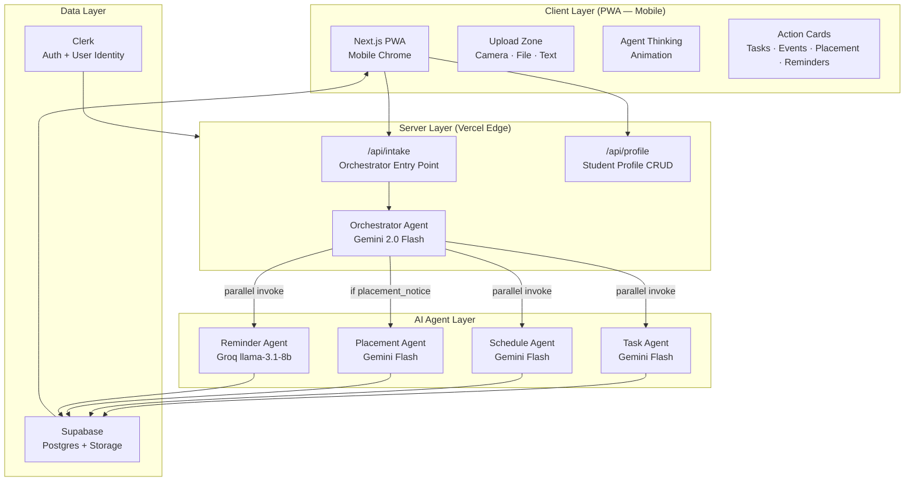
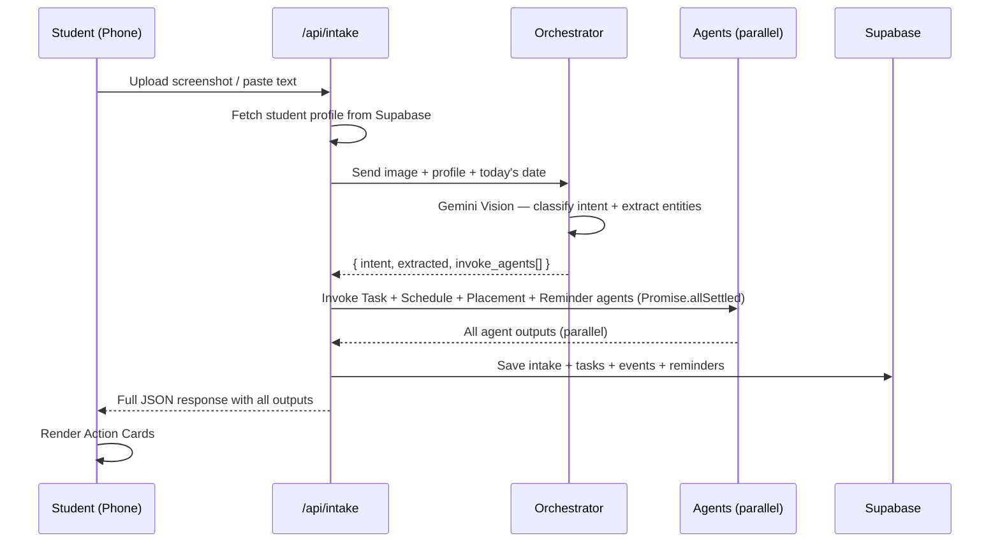
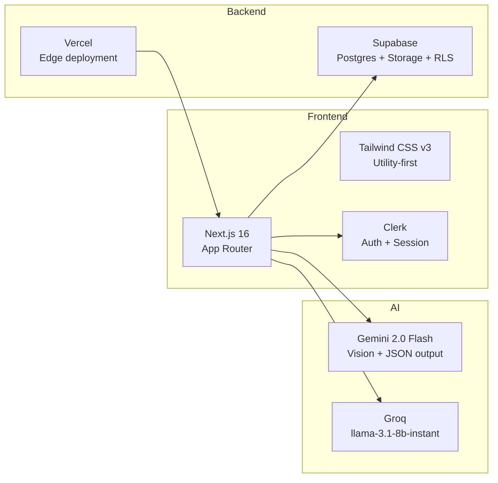
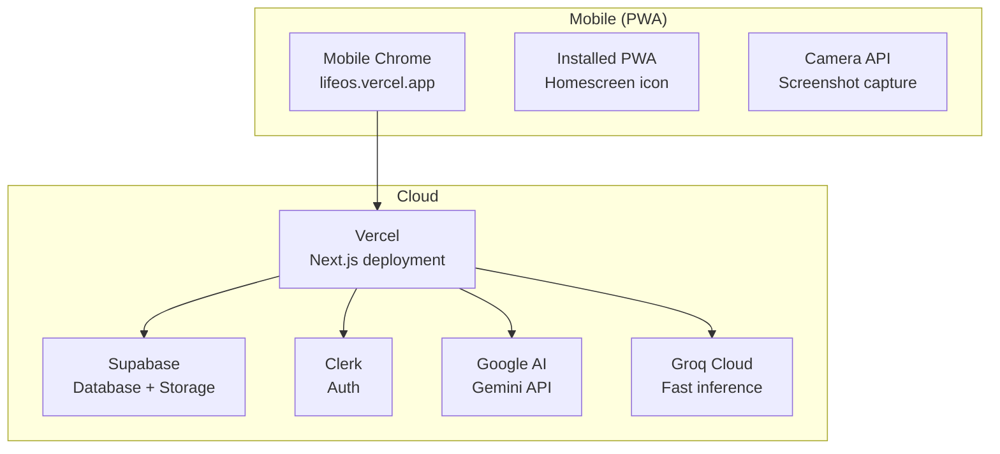

# LifeOS — High Level Design (HLD)

> **Project:** LifeOS — AI Chief of Staff for Students  
> **Stack:** Next.js 16 · Clerk · Supabase · Gemini 2.0 Flash · Groq

---

## 1. Problem Statement

Students receive critical information — placement notices, assignment deadlines, exam schedules, fee reminders — fragmented across WhatsApp groups, emails, PDFs, college notice boards, and voice notes. No existing tool:

- Understands **multimodal input** (image, PDF, text)
- Converts information to **actions automatically**
- **Checks eligibility** against the student's profile
- Works **phone-first**, the way students actually live

---

## 2. Solution Overview

LifeOS is a **phone-first, multi-agent AI system** that ingests any student document and automatically generates structured action: tasks, calendar events, study plans, placement prep, and reminders — without the student typing anything.

```
Student drops a screenshot →  LifeOS returns a complete action plan in < 10 seconds
```

---

## 3. System Architecture



---

## 4. Agent Ecosystem

| Agent | Model | Input | Output | When Invoked |
|---|---|---|---|---|
| **Orchestrator** | Gemini 2.0 Flash (vision) | Raw image / PDF / text | Intent classification + extracted JSON + routing decision | Always — first step |
| **Task Agent** | Gemini 2.0 Flash | Orchestrator output + profile | 3–6 prioritized tasks with due dates | All intents |
| **Schedule Agent** | Gemini 2.0 Flash | Orchestrator output + profile | 3–8 calendar events (deadlines + study blocks) | All intents |
| **Placement Agent** | Gemini 2.0 Flash | Orchestrator output + profile | Eligibility check + doc checklist + prep plan | `placement_notice` only |
| **Reminder Agent** | Groq llama-3.1-8b-instant | Orchestrator output + profile | 3 context-aware reminder messages with timing | All intents |

### Why Groq for Reminders?

Reminder message generation is **pure text** — no vision, no complex reasoning. Groq's llama-3.1-8b-instant runs at ~500 tokens/second, generating reminder messages in ~200ms vs ~1.5s on Gemini. This keeps total pipeline latency under 8 seconds.

---

## 5. Data Flow



---

## 6. Intent Classification

The Orchestrator classifies every input into one of 6 intents:

| Intent | Example Trigger | Agents Invoked |
|---|---|---|
| `placement_notice` | "TCS NQT Drive — Register by Friday" | Task + Schedule + Placement + Reminder |
| `assignment` | "DBMS project due this Friday" | Task + Schedule + Reminder |
| `exam` | Exam timetable PDF | Task + Schedule + Reminder |
| `timetable` | Weekly class schedule | Schedule + Reminder |
| `fee_notice` | "Fee payment deadline June 30" | Task + Reminder |
| `general` | Any other student notice | Task + Reminder |

---

## 7. Tech Stack



| Layer | Technology | Reason |
|---|---|---|
| Framework | Next.js 16 (App Router) | API routes + SSR + PWA in one repo |
| Styling | Tailwind CSS v3 | Mobile-first responsive utilities, rapid dev |
| Auth | Clerk | 5-minute setup, student profile identity |
| Database | Supabase (Postgres) | Tasks, events, reminders, profile storage |
| File Storage | Supabase Storage | Screenshot/PDF uploads |
| Primary AI | Gemini 2.0 Flash | Native multimodal (image+text), structured JSON output |
| Fast Text AI | Groq (llama-3.1-8b-instant) | Ultra-fast pure-text generation for reminders |
| Deployment | Vercel | Zero-config, env vars, preview URLs |

---

## 8. Phone-First Design Principles

LifeOS is designed mobile-first, built to run natively in a phone browser as an installable PWA.

| Principle | Implementation |
|---|---|
| Touch-first interactions | Large tap targets (min 44px), FAB for primary action |
| Camera capture | `react-dropzone` accepts `image/*` — triggers camera on mobile |
| Safe areas | `env(safe-area-inset-*)` for notch/chin handling |
| No-scroll key flows | Critical upload → processing → output fits one viewport |
| PWA installable | `manifest.json` + `apple-mobile-web-app-capable` meta |
| Dark mode default | Dark-only UI optimised for OLED phone screens |


## 9. Deployment Architecture


