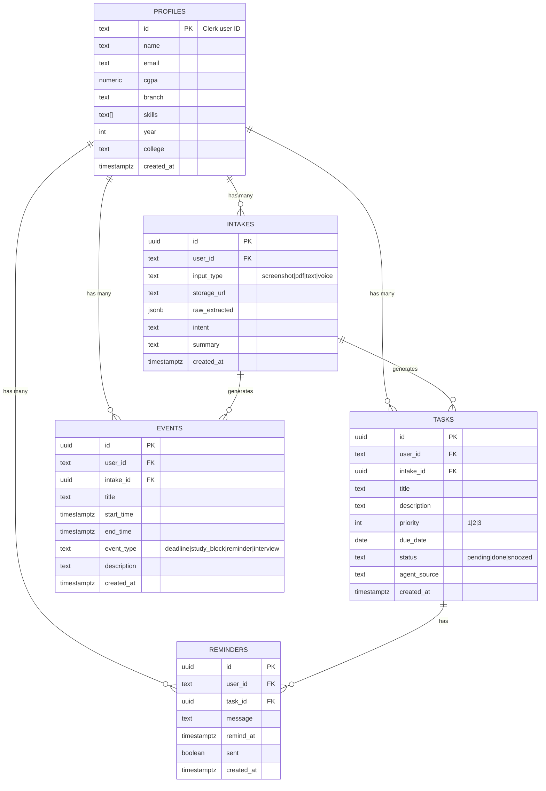
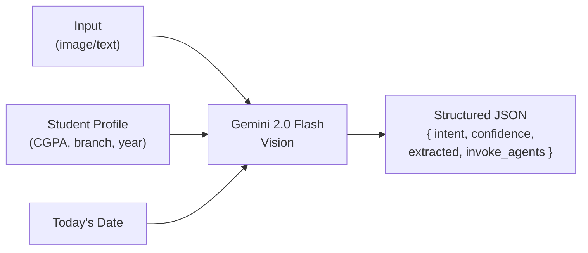
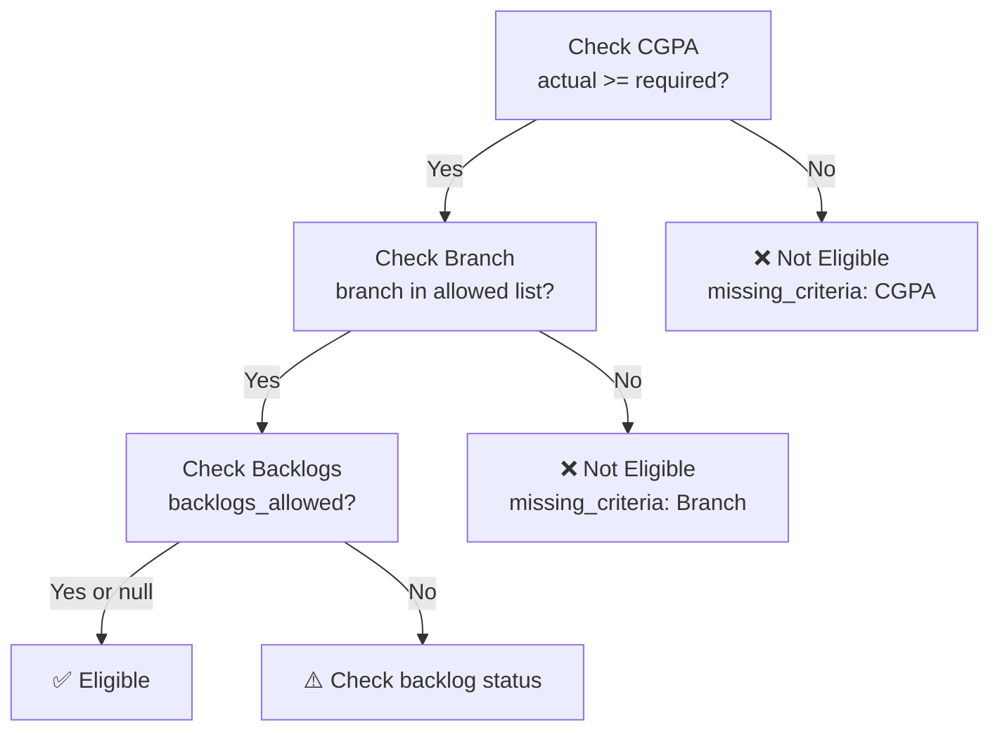
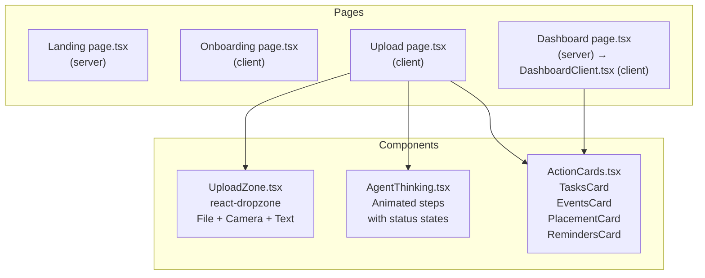
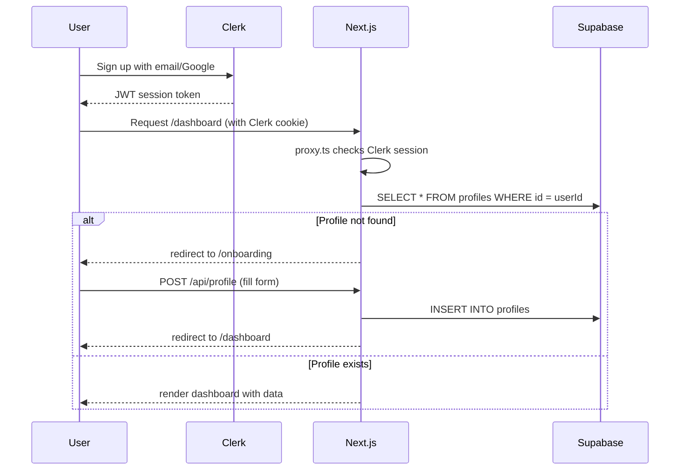

# LifeOS — Low Level Design (LLD)

> **Scope:** Internal component design, database schema, API contracts, agent prompt architecture, data models, and file structure.

---

## 1. Project File Structure

```
lifeos/
│
├── app/                              # Next.js App Router
│   ├── layout.tsx                    # Root layout — Clerk + PWA meta
│   ├── page.tsx                      # Landing page (public)
│   ├── globals.css                   # Tailwind + design tokens + animations
│   │
│   ├── sign-in/[[...sign-in]]/       # Clerk sign-in (catch-all)
│   │   └── page.tsx
│   ├── sign-up/[[...sign-up]]/       # Clerk sign-up (catch-all)
│   │   └── page.tsx
│   ├── onboarding/
│   │   └── page.tsx                  # First-time profile setup
│   ├── dashboard/
│   │   ├── page.tsx                  # Server component — fetches data
│   │   └── DashboardClient.tsx       # Client component — renders UI
│   ├── upload/
│   │   └── page.tsx                  # Upload → process → action cards
│   │
│   └── api/
│       ├── intake/
│       │   └── route.ts              # POST — main orchestration entry
│       └── profile/
│           └── route.ts              # GET + POST — student profile
│
├── components/
│   ├── UploadZone.tsx                # File drop + camera + text paste
│   ├── AgentThinking.tsx             # Animated agent processing UI
│   └── ActionCards.tsx              # TasksCard + EventsCard + PlacementCard + RemindersCard
│
├── lib/
│   ├── gemini.ts                     # Gemini 2.0 Flash client + helpers
│   ├── groq.ts                       # Groq llama client + helpers
│   ├── supabase.ts                   # Supabase client + TypeScript types
│   └── agents/
│       ├── orchestrator.ts           # Intent classification + routing
│       ├── task-agent.ts             # Task generation
│       ├── schedule-agent.ts         # Calendar event generation
│       ├── placement-agent.ts        # Eligibility + prep plan
│       └── reminder-agent.ts         # Context-aware reminders (Groq)
│
├── public/
│   ├── manifest.json                 # PWA manifest
│   ├── icon-192.png                  # PWA icon
│   └── icon-512.png                  # PWA splash icon
│
├── docs/
│   ├── HLD.md                        # This file's companion
│   └── LLD.md                        # This file
│
├── proxy.ts                          # Clerk auth proxy (Next.js 16)
├── next.config.mjs
├── tailwind.config.js
├── postcss.config.js
├── tsconfig.json
├── supabase-schema.sql               # Paste into Supabase SQL Editor
├── .env.local                        # API keys (gitignored)
├── .gitignore
└── package.json
```

---

## 2. Database Schema

### Entity Relationship Diagram



### Table Definitions

#### `profiles`
| Column | Type | Constraints | Description |
|---|---|---|---|
| `id` | `text` | PRIMARY KEY | Clerk user ID |
| `name` | `text` | NOT NULL | Full name |
| `email` | `text` | | Email from Clerk |
| `cgpa` | `numeric(4,2)` | default 0 | Out of 10 |
| `branch` | `text` | default 'CSE' | Dept: CSE, IT, ECE… |
| `skills` | `text[]` | default '{}' | e.g. ['Python', 'React'] |
| `year` | `int` | default 1 | 1–4 (or 5 for PG) |
| `college` | `text` | nullable | College name |
| `created_at` | `timestamptz` | default now() | |

#### `intakes`
| Column | Type | Constraints | Description |
|---|---|---|---|
| `id` | `uuid` | PRIMARY KEY | Auto-generated |
| `user_id` | `text` | FK → profiles.id | Owner |
| `input_type` | `text` | CHECK enum | screenshot / pdf / text / voice |
| `storage_url` | `text` | nullable | Supabase Storage URL for uploaded file |
| `raw_extracted` | `jsonb` | default '{}' | Full Orchestrator extracted JSON |
| `intent` | `text` | | placement_notice / assignment / exam… |
| `summary` | `text` | | One-line human summary |
| `created_at` | `timestamptz` | default now() | |

#### `tasks`
| Column | Type | Constraints | Description |
|---|---|---|---|
| `id` | `uuid` | PRIMARY KEY | |
| `user_id` | `text` | FK → profiles | Owner |
| `intake_id` | `uuid` | FK → intakes (nullable) | Source intake |
| `title` | `text` | NOT NULL | Max 60 chars |
| `description` | `text` | | Full description |
| `priority` | `int` | CHECK (1,2,3) | 1=High, 2=Med, 3=Low |
| `due_date` | `date` | nullable | |
| `status` | `text` | CHECK enum | pending / done / snoozed |
| `agent_source` | `text` | | 'task_agent' |
| `created_at` | `timestamptz` | | |

#### `events`
| Column | Type | Constraints | Description |
|---|---|---|---|
| `id` | `uuid` | PRIMARY KEY | |
| `user_id` | `text` | FK → profiles | |
| `intake_id` | `uuid` | FK → intakes (nullable) | |
| `title` | `text` | NOT NULL | |
| `start_time` | `timestamptz` | NOT NULL | |
| `end_time` | `timestamptz` | nullable | |
| `event_type` | `text` | CHECK enum | deadline / study_block / reminder / interview |
| `description` | `text` | nullable | |
| `created_at` | `timestamptz` | | |

#### `reminders`
| Column | Type | Constraints | Description |
|---|---|---|---|
| `id` | `uuid` | PRIMARY KEY | |
| `user_id` | `text` | FK → profiles | |
| `task_id` | `uuid` | FK → tasks (nullable) | |
| `message` | `text` | NOT NULL | Context-aware reminder text |
| `remind_at` | `timestamptz` | NOT NULL | When to notify |
| `sent` | `boolean` | default false | |
| `created_at` | `timestamptz` | | |

---

## 3. API Contracts

### `POST /api/intake`

**Auth:** Clerk session required

**Request (multipart/form-data):**
```
file: File          — image (PNG, JPG, WEBP) or PDF
```

**Request (application/json):**
```json
{
  "text": "TCS NQT Drive — Register by June 7...",
  "inputType": "text"
}
```

**Response 200:**
```json
{
  "success": true,
  "orchestrator": {
    "intent": "placement_notice",
    "confidence": 0.97,
    "summary": "TCS NQT drive registration closes June 7. You are eligible.",
    "invoke_agents": ["task", "schedule", "placement", "reminder"],
    "extracted": {
      "company": "TCS",
      "deadline": "2026-06-07",
      "eligibility": {
        "min_cgpa": 6.0,
        "branches": ["CSE", "IT", "ECE"],
        "backlogs_allowed": false
      },
      "documents_required": ["resume", "college ID", "10th marksheet"]
    }
  },
  "tasks": [
    {
      "title": "Register for TCS NQT on official portal",
      "description": "Complete registration at tcs.com/careers before June 7",
      "priority": 1,
      "due_date": "2026-06-07",
      "agent_source": "task_agent"
    }
  ],
  "events": [
    {
      "title": "TCS NQT Registration Deadline",
      "start_time": "2026-06-07T23:59:00",
      "end_time": "2026-06-07T23:59:00",
      "event_type": "deadline"
    }
  ],
  "placement": {
    "company": "TCS",
    "registration_deadline": "2026-06-07",
    "eligibility": {
      "eligible": true,
      "cgpa_check": { "required": 6.0, "actual": 7.8, "passed": true },
      "branch_check": { "required": ["CSE","IT","ECE"], "actual": "CSE", "passed": true }
    },
    "documents_checklist": [
      { "doc": "Updated Resume", "status": "needs_update" },
      { "doc": "College ID", "status": "likely_available" }
    ],
    "prep_plan": [
      { "week": 1, "label": "Week 1", "focus": "Aptitude & Reasoning", "tasks": ["50 quant questions daily", "2 mock tests"] }
    ]
  },
  "reminders": [
    {
      "message": "Hey Riya! TCS NQT registration closes in 2 days...",
      "remind_at": "2026-06-05T09:00:00",
      "tone": "encouraging",
      "why_it_matters": "Missing this means waiting another year for TCS recruitment."
    }
  ],
  "intake_id": "uuid-string"
}
```

**Error responses:**
| Code | Meaning |
|---|---|
| 401 | No Clerk session |
| 404 | Profile not created yet → redirect to /onboarding |
| 400 | No file or text provided |
| 500 | Gemini/Groq API error |

---

### `GET /api/profile`

Returns current user's profile or `{ profile: null }` if not set up.

### `POST /api/profile`

**Body:**
```json
{
  "name": "Riya Sharma",
  "email": "riya@example.com",
  "cgpa": 7.8,
  "branch": "CSE",
  "year": 3,
  "college": "Delhi Technological University",
  "skills": ["Python", "React", "SQL"]
}
```

Uses Supabase `upsert` — safe to call on both create and update.

---

## 4. Agent Architecture (Prompt Design)

### Orchestrator Agent



**Responsibilities:**
1. Read multimodal input (image or text)
2. Extract all structured entities (dates, names, requirements)
3. Classify intent from fixed enum
4. Decide which downstream agents to invoke
5. Resolve relative dates ("this Friday") to absolute ISO dates

**Output schema:**
```typescript
type OrchestratorOutput = {
  intent: 'placement_notice' | 'assignment' | 'exam' | 'timetable' | 'general' | 'fee_notice';
  confidence: number;           // 0.0–1.0
  summary: string;              // One-sentence human readable
  invoke_agents: string[];      // ['task', 'schedule', 'placement', 'reminder']
  extracted: {
    company?: string;
    deadline?: string;          // YYYY-MM-DD
    eligibility?: { min_cgpa, branches, backlogs_allowed };
    documents_required?: string[];
    // ...other fields
  };
};
```

---

### Task Agent

**Input:** OrchestratorOutput + Profile  
**Model:** Gemini 2.0 Flash  
**Output:** 3–6 tasks with title, description, priority, due_date

**Priority logic:**
| Days until due | Priority |
|---|---|
| < 3 days | 1 (High) — red |
| 3–7 days | 2 (Medium) — yellow |
| > 7 days | 3 (Low) — green |

---

### Schedule Agent

**Input:** OrchestratorOutput + Profile  
**Model:** Gemini 2.0 Flash  
**Output:** 3–8 calendar events

**Event generation rules:**
| Event Type | Timing Rule |
|---|---|
| `deadline` | At 23:59 on the due date |
| `study_block` | 09:00–11:00 or 19:00–21:00 on prep days |
| `reminder` | 09:00 the day before deadline |
| `interview` | At the specified date/time |

---

### Placement Agent

**Input:** OrchestratorOutput + Profile  
**Model:** Gemini 2.0 Flash  
**Invoked only when:** `intent === 'placement_notice'`

**Eligibility check matrix:**



**Prep plan:** 2–3 weeks, covering:
- Week 1: Aptitude & Quantitative reasoning
- Week 2: Technical / domain prep
- Week 3 (if time): HR prep + mock interviews

---

### Reminder Agent

**Input:** OrchestratorOutput + Profile  
**Model:** Groq llama-3.1-8b-instant  
**Why Groq:** Pure text task — ultra-fast (~200ms), lower cost

**Reminder timing strategy (5-day example):**
| Reminder | When | Tone |
|---|---|---|
| #1 | Today at 20:00 | Informational |
| #2 | 2 days before deadline, 09:00 | Encouraging |
| #3 | 1 day before deadline, 09:00 | Urgent |

---

## 5. Component Architecture



### Component Props

#### `UploadZone`
```typescript
type UploadZoneProps = {
  onUpload: (file: File | null, text?: string) => void;
  loading?: boolean;
};
```
Modes: file drop → image preview → submit | text mode → textarea → submit

#### `AgentThinking`
```typescript
type AgentThinkingProps = {
  intent?: string;  // hides Placement Agent step if not placement_notice
};
```
State machine: `waiting → active → done` per step, auto-advancing every 900ms.

#### Action Cards (all in `ActionCards.tsx`)
```typescript
TasksCard      ({ tasks: GeneratedTask[] })
EventsCard     ({ events: GeneratedEvent[] })
PlacementCard  ({ placement: PlacementAgentOutput })
RemindersCard  ({ reminders: GeneratedReminder[] })
```

---

## 6. TypeScript Data Models

### Agent Output Types

```typescript
// Orchestrator
type OrchestratorOutput = { intent, confidence, summary, invoke_agents, extracted }

// Task Agent
type GeneratedTask = {
  title: string;       // max 60 chars, action-oriented
  description: string;
  priority: 1 | 2 | 3;
  due_date: string | null;  // YYYY-MM-DD
  agent_source: string;
};

// Schedule Agent
type GeneratedEvent = {
  title: string;
  start_time: string;   // ISO datetime
  end_time: string;
  event_type: 'deadline' | 'study_block' | 'reminder' | 'interview';
  description?: string;
};

// Placement Agent
type EligibilityCheck = {
  eligible: boolean;
  cgpa_check: { required: number | null; actual: number; passed: boolean };
  branch_check: { required: string[] | null; actual: string; passed: boolean };
  backlog_check: { backlogs_allowed: boolean | null; message: string };
  overall_reasons: string[];
  missing_criteria: string[];
};

// Reminder Agent
type GeneratedReminder = {
  message: string;
  remind_at: string;  // ISO datetime
  tone: 'urgent' | 'encouraging' | 'informational';
  why_it_matters: string;
};
```

---

## 7. Authentication Flow



---

## 8. Environment Variables

| Variable | Source | Used In |
|---|---|---|
| `NEXT_PUBLIC_CLERK_PUBLISHABLE_KEY` | Clerk Dashboard | Client-side auth |
| `CLERK_SECRET_KEY` | Clerk Dashboard | Server-side auth verification |
| `NEXT_PUBLIC_SUPABASE_URL` | Supabase Dashboard | Client + server queries |
| `NEXT_PUBLIC_SUPABASE_ANON_KEY` | Supabase Dashboard | Client-side queries |
| `SUPABASE_SERVICE_ROLE_KEY` | Supabase Dashboard | Server-only (bypasses RLS) |
| `GEMINI_API_KEY` | Google AI Studio | All vision + text agents |
| `GROQ_API_KEY` | Groq Console | Reminder Agent |

---

## 9. Error Handling Strategy

| Layer | Strategy |
|---|---|
| API routes | try/catch → `{ error, details }` JSON with appropriate HTTP status |
| Agent calls | `Promise.allSettled` — one failing agent doesn't kill the whole response |
| Gemini JSON parse | Regex fallback to extract JSON from markdown code blocks |
| Groq JSON parse | `response_format: { type: 'json_object' }` enforces valid JSON |
| UI | Error state with retry button, no crash |

---

## 10. Performance Targets

| Metric | Target | Approach |
|---|---|---|
| Time to first agent output | < 3s | Gemini Flash is fastest Gemini model |
| Total pipeline time | < 10s | All agents run in parallel via `Promise.allSettled` |
| Build size | < 500KB JS | No heavy libraries, Tailwind purges unused CSS |
| Mobile FCP | < 1.5s | Static landing, dynamic dashboard server-rendered |
| PWA install prompt | On first visit | `manifest.json` + HTTPS (Vercel) |
