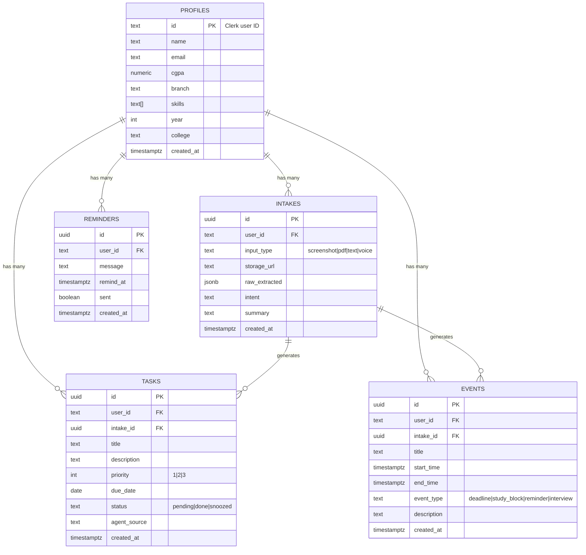
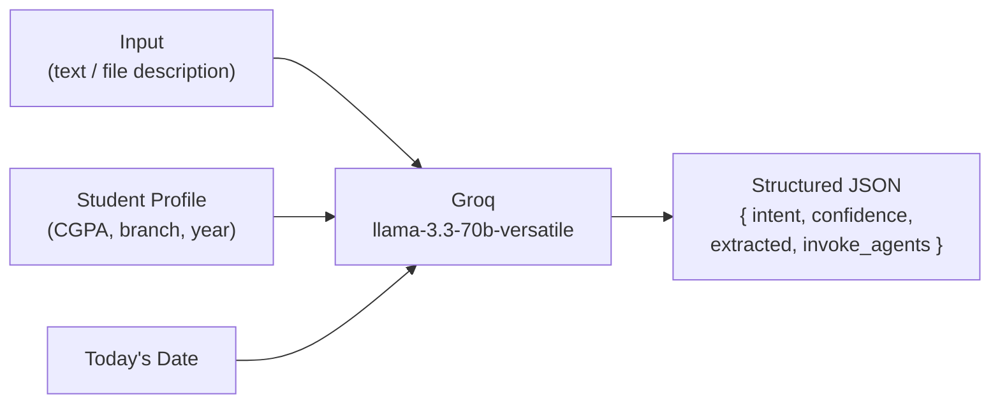
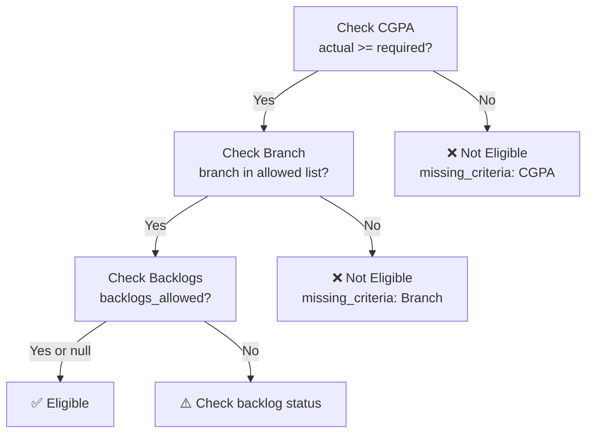
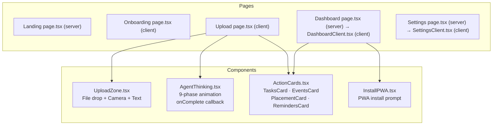
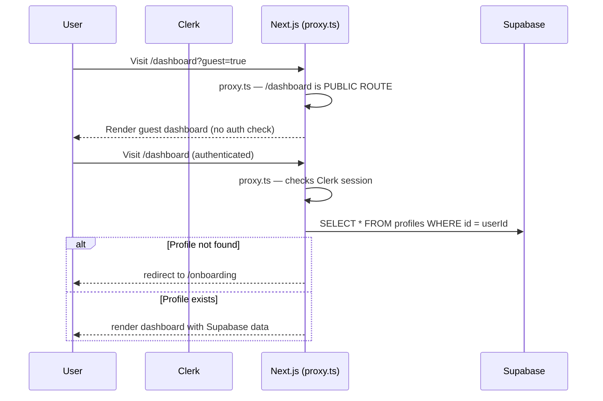

# LifeOS — Low Level Design (LLD)

> **Scope:** Internal component design, database schema, API contracts, agent prompt architecture, data models, and file structure.  
> **Version:** 2.0 — Hackathon Build

---

## 1. Project File Structure

```
lifeos/
│
├── app/                              # Next.js App Router
│   ├── layout.tsx                    # Root layout — Clerk + PWA meta
│   ├── page.tsx                      # Landing page (public)
│   ├── landing-client.tsx            # Landing page client component
│   ├── globals.css                   # Design tokens + animations + utilities
│   │
│   ├── sign-in/[[...sign-in]]/       # Clerk sign-in (catch-all)
│   │   └── page.tsx
│   ├── sign-up/[[...sign-up]]/       # Clerk sign-up (catch-all)
│   │   └── page.tsx
│   ├── onboarding/
│   │   └── page.tsx                  # First-time profile setup
│   ├── dashboard/
│   │   ├── page.tsx                  # Server component — fetches data or serves guest
│   │   └── DashboardClient.tsx       # Client component — renders full dashboard UI
│   ├── upload/
│   │   └── page.tsx                  # Upload → agent animation → result cards
│   ├── settings/
│   │   ├── page.tsx                  # Settings page server wrapper
│   │   └── SettingsClient.tsx        # Settings UI — integration toggles + preferences
│   │
│   └── api/
│       ├── intake/
│       │   └── route.ts              # POST — main orchestration entry (guest + auth)
│       └── profile/
│           └── route.ts              # GET + POST — student profile CRUD
│
├── components/
│   ├── UploadZone.tsx                # File drop + camera + text paste input
│   ├── AgentThinking.tsx             # 9-phase animated agent processing UI
│   │                                 # Props: { intent?, onComplete? }
│   ├── ActionCards.tsx               # TasksCard + EventsCard + PlacementCard + RemindersCard
│   └── InstallPWA.tsx                # PWA install prompt component
│
├── lib/
│   ├── groq.ts                       # Groq client + JSON parsing helpers
│   ├── supabase.ts                   # Supabase client + TypeScript types
│   ├── prestored-answers.ts          # 7 demo example prestored responses
│   └── agents/
│       ├── orchestrator.ts           # Intent classification + routing (Groq 70b)
│       ├── task-agent.ts             # Task generation (Groq 70b)
│       ├── schedule-agent.ts         # Calendar event generation (Groq 70b)
│       ├── placement-agent.ts        # Eligibility check + prep plan (Groq 70b)
│       ├── reminder-agent.ts         # Context-aware reminders (Groq 8b-instant)
│       ├── expense-agent.ts          # Expense parsing + budget tip (Groq 70b)
│       ├── study-agent.ts            # Study kit: summary + flashcards + quiz (Groq 70b)
│       └── content-agent.ts          # Draft letters/emails/NOC (Groq 70b)
│
├── public/
│   ├── manifest.json                 # PWA manifest
│   ├── favicon.png                   # App favicon (used in all header logos)
│   ├── icon-192.png                  # PWA icon
│   └── icon-512.png                  # PWA splash icon
│
├── docs/
│   ├── HLD.md                        # High Level Design
│   ├── LLD.md                        # This file
│   └── LifeOS-pitch-deck.pdf         # Hackathon pitch deck
│
├── scripts/
│   ├── supabase-schema.sql           # Paste into Supabase SQL Editor
│   └── seed-demo-data.sql            # Optional demo data for testing
│
├── proxy.ts                          # Clerk auth middleware (non-standard filename)
│                                     # Public routes: /, /sign-in, /sign-up,
│                                     # /dashboard, /upload, /settings, /api/intake
├── next.config.mjs
├── tailwind.config.js
├── postcss.config.js
├── tsconfig.json
├── .env.local                        # API keys (gitignored)
├── .gitignore
└── package.json
```

---

## 2. Database Schema

### Entity Relationship Diagram



### Table Definitions

#### `profiles`
| Column | Type | Constraints | Description |
|---|---|---|---|
| `id` | `text` | PRIMARY KEY | Clerk user ID |
| `name` | `text` | NOT NULL | Full name |
| `email` | `text` | | Email from Clerk |
| `cgpa` | `numeric(4,2)` | default 0 | Out of 10 |
| `branch` | `text` | default 'CSE' | Dept: CSE, IT, ECE… |
| `skills` | `text[]` | default '{}' | e.g. ['Python', 'React'] |
| `year` | `int` | default 1 | 1–4 (or 5 for PG) |
| `college` | `text` | nullable | College name |
| `created_at` | `timestamptz` | default now() | |

#### `intakes`
| Column | Type | Constraints | Description |
|---|---|---|---|
| `id` | `uuid` | PRIMARY KEY | Auto-generated |
| `user_id` | `text` | FK → profiles.id | Owner |
| `input_type` | `text` | CHECK enum | screenshot / pdf / text / voice |
| `storage_url` | `text` | nullable | Supabase Storage URL for uploaded file |
| `raw_extracted` | `jsonb` | default '{}' | Full Orchestrator extracted JSON |
| `intent` | `text` | | placement_notice / assignment / exam / expense_receipt… |
| `summary` | `text` | | One-line human summary |
| `created_at` | `timestamptz` | default now() | |

#### `tasks`
| Column | Type | Constraints | Description |
|---|---|---|---|
| `id` | `uuid` | PRIMARY KEY | |
| `user_id` | `text` | FK → profiles | Owner |
| `intake_id` | `uuid` | FK → intakes (nullable) | Source intake |
| `title` | `text` | NOT NULL | Max 60 chars |
| `description` | `text` | | Full description |
| `priority` | `int` | CHECK (1,2,3) | 1=High, 2=Med, 3=Low |
| `due_date` | `date` | nullable | |
| `status` | `text` | CHECK enum | pending / done / snoozed |
| `agent_source` | `text` | | 'task_agent' |
| `created_at` | `timestamptz` | | |

#### `events`
| Column | Type | Constraints | Description |
|---|---|---|---|
| `id` | `uuid` | PRIMARY KEY | |
| `user_id` | `text` | FK → profiles | |
| `intake_id` | `uuid` | FK → intakes (nullable) | |
| `title` | `text` | NOT NULL | |
| `start_time` | `timestamptz` | NOT NULL | |
| `end_time` | `timestamptz` | nullable | |
| `event_type` | `text` | CHECK enum | deadline / study_block / reminder / interview |
| `description` | `text` | nullable | |
| `created_at` | `timestamptz` | | |

#### `reminders`
| Column | Type | Constraints | Description |
|---|---|---|---|
| `id` | `uuid` | PRIMARY KEY | |
| `user_id` | `text` | FK → profiles | |
| `message` | `text` | NOT NULL | Context-aware reminder text |
| `remind_at` | `timestamptz` | NOT NULL | When to notify |
| `sent` | `boolean` | default false | |
| `created_at` | `timestamptz` | | |

---

## 3. API Contracts

### `POST /api/intake`

**Auth:** Clerk session OR `x-guest-mode: true` header

**Request (multipart/form-data):**
```
file: File          — image (PNG, JPG, WEBP) or PDF
```

**Request (application/json):**
```json
{
  "text": "TCS NQT Drive — Register by June 7...",
  "inputType": "text"
}
```

**Guest Mode Header:**
```
x-guest-mode: true
```
When set, bypasses Clerk auth and uses hardcoded guest profile.

**Demo Intercept Logic:**
The route checks `textInput` against 7 known trigger phrases before calling any AI:
```typescript
// Example triggers:
"alert: tcs nqt..."       → example-all (Multi-Agent Mega Demo)
"tcs nqt drive..."        → example-tcs
"dbms mini project..."    → example-assignment
"end semester exams..."   → example-exam
"spent today: canteen..." → example-expense
"cpu scheduling notes..." → example-study
"draft a leave..."        → example-content

// If matched: await 15,500ms then return PRESTORED_ANSWERS[id]
```

**Full Response 200:**
```json
{
  "success": true,
  "orchestrator": {
    "intent": "placement_notice",
    "confidence": 0.97,
    "summary": "TCS NQT drive registration closes June 7. You are eligible.",
    "invoke_agents": ["task", "schedule", "placement", "reminder"],
    "extracted": { "company": "TCS", "deadline": "2026-06-07" }
  },
  "tasks": [{ "title": "...", "priority": 1, "due_date": "2026-06-07", "agent_source": "task_agent" }],
  "events": [{ "title": "...", "start_time": "...", "event_type": "deadline" }],
  "placement": {
    "company": "TCS",
    "eligibility": { "eligible": true, "cgpa_check": {...}, "branch_check": {...} },
    "documents_checklist": [...],
    "prep_plan": [...]
  },
  "reminders": [{ "message": "...", "remind_at": "...", "tone": "encouraging" }],
  "expense": {
    "expenses": [{ "merchant": "Canteen", "amount": 80, "category": "food" }],
    "total": 505,
    "summary": "...",
    "budget_tip": "..."
  },
  "study": {
    "subject": "CPU Scheduling",
    "summary_points": ["..."],
    "flashcards": [{ "question": "...", "answer": "..." }],
    "quiz": [{ "question": "...", "options": [...], "correct": 0, "explanation": "..." }],
    "study_tip": "..."
  },
  "content": {
    "subject": "Leave Application",
    "content_type": "leave_application",
    "draft": "Respected Sir/Madam...",
    "tone": "formal",
    "word_count": 120
  },
  "intake_id": "uuid-string"
}
```

**Error responses:**
| Code | Meaning |
|---|---|
| 401 | No Clerk session and not guest mode |
| 404 | Profile not created yet → redirect to /onboarding |
| 400 | No file or text provided |
| 429 | Groq rate limit — includes `retryAfter` seconds |
| 500 | Agent/API error |

---

### `GET /api/profile`

Returns current user's profile or `{ profile: null }` if not set up.

### `POST /api/profile`

**Body:**
```json
{
  "name": "Tushar Bhardwaj",
  "email": "tushar@example.com",
  "cgpa": 9.2,
  "branch": "CSE",
  "year": 3,
  "college": "iQOO Institute of Tech",
  "skills": ["React", "TypeScript", "Python"]
}
```

Uses Supabase `upsert` — safe to call on both create and update.

---

## 4. Agent Architecture (Prompt Design)

### Orchestrator Agent



**Output schema:**
```typescript
type OrchestratorOutput = {
  intent: 'placement_notice' | 'assignment' | 'exam' | 'timetable'
        | 'fee_notice' | 'expense_receipt' | 'study_notes' | 'content_request' | 'general';
  confidence: number;           // 0.0–1.0
  summary: string;              // One-sentence human readable
  invoke_agents: string[];      // ['task', 'schedule', 'placement', 'reminder', 'expense', 'study', 'content']
  extracted: Record<string, any>;
};
```

---

### Task Agent
**Model:** Groq llama-3.3-70b-versatile  
**Output:** 3–6 tasks with title, description, priority, due_date

**Priority logic:**
| Days until due | Priority |
|---|---|
| < 3 days | 1 (High) — red |
| 3–7 days | 2 (Medium) — yellow |
| > 7 days | 3 (Low) — green |

---

### Schedule Agent
**Model:** Groq llama-3.3-70b-versatile  
**Output:** 3–8 calendar events

**Event generation rules:**
| Event Type | Timing Rule |
|---|---|
| `deadline` | At 23:59 on the due date |
| `study_block` | 09:00–11:00 or 19:00–21:00 on prep days |
| `reminder` | 09:00 the day before deadline |
| `interview` | At the specified date/time |

---

### Placement Agent
**Model:** Groq llama-3.3-70b-versatile  
**Invoked only when:** `intent === 'placement_notice'`



---

### Reminder Agent
**Model:** Groq llama-3.1-8b-instant  
**Why 8b:** Pure text task — ultra-fast (~200ms), lower cost

**Reminder timing strategy:**
| Reminder | When | Tone |
|---|---|---|
| #1 | Today at 20:00 | Informational |
| #2 | 2 days before deadline, 09:00 | Encouraging |
| #3 | 1 day before deadline, 09:00 | Urgent |

---

### Expense Agent
**Model:** Groq llama-3.3-70b-versatile  
**Input:** Raw text describing expenses (or receipt image description)  
**Output:**
```typescript
type ExpenseAgentOutput = {
  expenses: Array<{
    merchant: string;
    amount: number;
    category: 'food' | 'transport' | 'books' | 'education' | 'shopping' | 'health' | 'entertainment' | 'other';
    description: string;
  }>;
  total: number;
  summary: string;
  budget_tip: string;
};
```

---

### Study Agent
**Model:** Groq llama-3.3-70b-versatile  
**Input:** Raw study notes / lecture content  
**Output:**
```typescript
type StudyAgentOutput = {
  subject: string;
  summary_points: string[];           // 4–6 key highlights
  flashcards: Array<{ question: string; answer: string }>;  // 5–8 cards
  quiz: Array<{
    question: string;
    options: string[];                // 4 options
    correct: number;                  // index 0–3
    explanation: string;
  }>;                                 // 3–5 questions
  study_tip: string;
};
```

---

### Content Agent
**Model:** Groq llama-3.3-70b-versatile  
**Input:** User request (e.g., "Draft a leave letter to HOD")  
**Output:**
```typescript
type ContentAgentOutput = {
  subject: string;
  content_type: 'leave_application' | 'email' | 'noc_request' | 'complaint' | 'other';
  draft: string;                      // Full professional draft
  tone: 'formal' | 'semi_formal' | 'friendly';
  word_count: number;
};
```

---

## 5. Component Architecture



---

### `AgentThinking` Component Detail

```typescript
type AgentThinkingProps = {
  intent?: string;       // hides Placement Agent if not placement_notice
  onComplete?: () => void; // fires 1.2s after last agent phase completes
};
```

**Phase timeline (9 phases):**
```
Phase 0 → Intake Agent active          2500ms
Phase 1 → Orchestrator active         2000ms
Phase 2 → All parallel agents start   1800ms
Phase 3 → Task Agent done             1500ms
Phase 4 → Schedule Agent done         1400ms
Phase 5 → Placement Agent done        1300ms
Phase 6 → Reminder Agent done         1200ms
Phase 7 → Expense Agent done          1100ms
Phase 8 → Study Agent done            1000ms
Phase 9 → Content Agent done → onComplete() fires after +1200ms
```

**Total animation duration:** ~15,300ms  
**API mock delay for demos:** 15,500ms (ensures API finishes before animation gate opens)

**State machine per agent:**
```
waiting → active → done
```

**Parent page sync logic (Upload page.tsx):**
```typescript
const [apiData, setApiData] = useState(null);
const [animationDone, setAnimationDone] = useState(false);

// Only transition to 'done' when BOTH conditions are met:
useEffect(() => {
  if (apiData && animationDone) {
    setResult(apiData);
    setState('done');
  }
}, [apiData, animationDone]);
```

---

### `SettingsClient` Component Detail

Accessible at `/settings` — public route (no auth required).

**State:**
```typescript
const [isGuest, setIsGuest] = useState(false);  // detected from localStorage
const [googleCalendar, setGoogleCalendar] = useState(true);
const [whatsappBot, setWhatsappBot] = useState(false);
const [gmailScan, setGmailScan] = useState(true);
// + sub-settings for each integration
// + notification toggles
// + AI preferences
```

**Back navigation:** Uses `isGuest` to route to `/dashboard?guest=true` or `/dashboard`.

---

## 6. TypeScript Data Models

```typescript
// Supabase DB types
type Profile = { id: string; name: string; email: string; cgpa: number; branch: string; skills: string[]; year: number; college: string; created_at: string };
type Task = { id: string; user_id: string; intake_id: string | null; title: string; description: string; priority: 1|2|3; due_date: string|null; status: 'pending'|'done'|'snoozed'; agent_source: string; created_at: string };
type CalendarEvent = { id: string; user_id: string; intake_id: string|null; title: string; start_time: string; end_time: string|null; event_type: string; description: string|null; created_at: string };
type Reminder = { id: string; user_id: string; message: string; remind_at: string; sent: boolean };
type Intake = { id: string; user_id: string; input_type: string; raw_extracted: any; intent: string; summary: string; created_at: string };

// Agent output types
type GeneratedTask = { title: string; description: string; priority: 1|2|3; due_date: string|null; agent_source: string };
type GeneratedEvent = { title: string; start_time: string; end_time: string; event_type: 'deadline'|'study_block'|'reminder'|'interview'; description?: string };
type GeneratedReminder = { message: string; remind_at: string; tone: 'urgent'|'encouraging'|'informational'; why_it_matters: string };
type PlacementAgentOutput = { company: string; registration_deadline: string; eligibility: EligibilityCheck; documents_checklist: DocItem[]; prep_plan: PrepWeek[] };
type ExpenseAgentOutput = { expenses: ExpenseItem[]; total: number; summary: string; budget_tip: string };
type StudyAgentOutput = { subject: string; summary_points: string[]; flashcards: Flashcard[]; quiz: QuizQuestion[]; study_tip: string };
type ContentAgentOutput = { subject: string; content_type: string; draft: string; tone: string; word_count: number };
```

---

## 7. Prestored Answers (Demo Mode)

**File:** `lib/prestored-answers.ts`

Contains 7 complete mock responses keyed by example ID:

| Key | Trigger Text | Agents Used |
|---|---|---|
| `example-all` | "ALERT: TCS NQT..." | All 7 |
| `example-tcs` | "TCS NQT Drive..." | Task + Schedule + Placement + Reminder |
| `example-assignment` | "DBMS Mini Project..." | Task + Schedule + Reminder |
| `example-exam` | "End Semester Exams..." | Task + Schedule + Reminder |
| `example-expense` | "Spent today: Canteen..." | Expense + Reminder |
| `example-study` | "CPU Scheduling Notes..." | Study + Task + Reminder |
| `example-content` | "Draft a leave application..." | Content + Reminder |

Each prestored answer includes full orchestrator, tasks, events, placement, expense, study, content, and reminders payloads — returning after a **15,500ms artificial delay** to keep the animation in sync.

---

## 8. Authentication + Public Route Flow



**Public routes in `proxy.ts`:**
```typescript
publicRoutes: ['/', '/sign-in(.*)', '/sign-up(.*)', '/dashboard(.*)', '/upload(.*)', '/settings(.*)']
```

> **Note:** `proxy.ts` is used instead of the standard `middleware.ts` filename — this is intentional for this project.

---

## 9. Guest Mode LocalStorage Schema

When in guest mode, all data is stored in `localStorage` under these keys:

| Key | Type | Contents |
|---|---|---|
| `lifeos_guest` | `'true'` / `'false'` | Guest mode flag |
| `lifeos_guest_tasks` | `Task[]` JSON | All tasks from this session |
| `lifeos_guest_events` | `CalendarEvent[]` JSON | All events from this session |
| `lifeos_guest_reminders` | `Reminder[]` JSON | All reminders from this session |
| `lifeos_guest_intakes` | `Intake[]` JSON | All intake records from this session |

All guest data is cleared on `beforeunload` (browser tab close).

---

## 10. Environment Variables

| Variable | Source | Used In |
|---|---|---|
| `NEXT_PUBLIC_CLERK_PUBLISHABLE_KEY` | Clerk Dashboard | Client-side auth |
| `CLERK_SECRET_KEY` | Clerk Dashboard | Server-side auth verification |
| `NEXT_PUBLIC_SUPABASE_URL` | Supabase Dashboard | Client + server queries |
| `NEXT_PUBLIC_SUPABASE_ANON_KEY` | Supabase Dashboard | Client-side queries |
| `SUPABASE_SERVICE_ROLE_KEY` | Supabase Dashboard | Server-only (bypasses RLS) |
| `GROQ_API_KEY` | Groq Console | All 7 agents |

> No Gemini API key required — all AI now runs exclusively on Groq.

---

## 11. Error Handling Strategy

| Layer | Strategy |
|---|---|
| API routes | try/catch → `{ error, details }` JSON with appropriate HTTP status |
| Agent calls | `Promise.allSettled` — one failing agent doesn't kill the whole response |
| Groq JSON parse | `response_format: { type: 'json_object' }` enforces valid JSON |
| Rate limits | 429 returned with `retryAfter` seconds extracted from error message |
| UI | Error state with retry button; no crash; animation resets cleanly |
| Guest mode | All data ops wrapped in `typeof window !== 'undefined'` guards |

---

## 12. Performance Targets

| Metric | Target | Approach |
|---|---|---|
| Demo pipeline time | ~15.5s | Prestored answers + animation sync gate |
| Real pipeline time | < 15s | All 7 agents run in parallel via `Promise.allSettled` |
| Agent call latency | < 2s each | Groq llama-3.3-70b at ~500 tokens/s |
| Build size | < 500KB JS | No heavy libraries, Tailwind purges unused CSS |
| Mobile FCP | < 1.5s | Static landing, dynamic dashboard server-rendered |
| PWA install prompt | On first visit | `manifest.json` + HTTPS (Vercel) |
